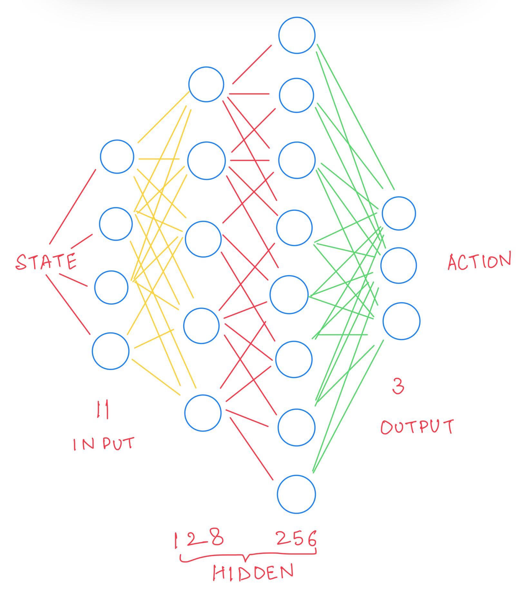

# SnakeGame-AI

This project aims to create an artificial intelligence model for the [Snake](snake-wiki) game. The goal of the snake is to eat the food continuosly. The snake dies on hitting the boundaries or hitting itself. The project is based on Reinforcement Learning.

# Demo Video

https://www.youtube.com/watch?v=XwbY4fN6RZw

# Algorithm

We have snake and food on the board randomly placed.
1. We calculate the state of the snake using the 11 values and if any of the conditions is true then set that value to one else set zero. The 11 state values (in order) are as follows:
  * danger straight
  * danger right
  * danger left
  * current moving direction left
  * current moving direction right
  * current moving direction up
  * current moving direction down
  * food left
  * food right
  * food up
  * food down

2. After getting these states, the agent would pass this to the model and get the action to perform. The action can have the following three values:
  * [1,0,0]: Go Striaght
  * [0,1,0]: Turn Right
  * [0,0,1]: Turn Left
  
3. The model is a neural network with 2 hidden layers as shown in the following figure:

  
  
4. After executing the action we calculate the reward. Rewards are defined as below:
  * Eating Food: +10
  * Dying or not eating food for too long: -10
  * Else: 0

5. Finally we update the Q value using the Bellman Equation. Q value represents the quality of the action.

 

